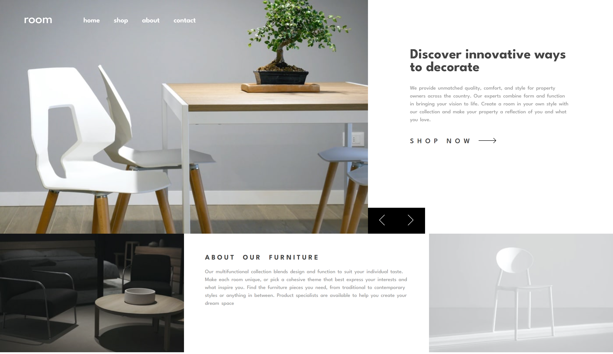

# room-homepage-master

This is a solution to the [Room homepage challenge on Frontend Mentor](https://www.frontendmentor.io/challenges/room-homepage-BtdBY_ENq). Frontend Mentor challenges help you improve your coding skills by building realistic projects. 

## Overview

### The challenge

Users should be able to:

- View the optimal layout for the site depending on their device's screen size
- See hover states for all interactive elements on the page
- Navigate the slider using either their mouse/trackpad or keyboard

### Screenshot

### Links

- Solution URL: [Add solution URL here](https://github.com/yonathan-palma/room-homepage-master)
- Live Site URL: [Add live site URL here](https://yonathan-palma.github.io/room-homepage-master/)

## My process

### Built with

- Semantic HTML5 markup
- CSS custom properties
- Flexbox
- CSS Grid
- JavaScript

### What I learned

I learned that scroll-snap is not always the best option for sliders XD

### Useful resources

- [Scroll Snap](https://midu.dev/css-scroll-snap-la-solucion-definitiva-a-la-creacion-de-sliders-en-la-web/) - patrón de diseño de slider nativo css con Scroll Snap.

## Author

- Website - [Yonathan Palma](https://github.com/yonathan-palma)
- Frontend Mentor - [@yonathan-palma](https://www.frontendmentor.io/profile/yonathan-palma# coding-bootcamp-testimonials-slider-master
